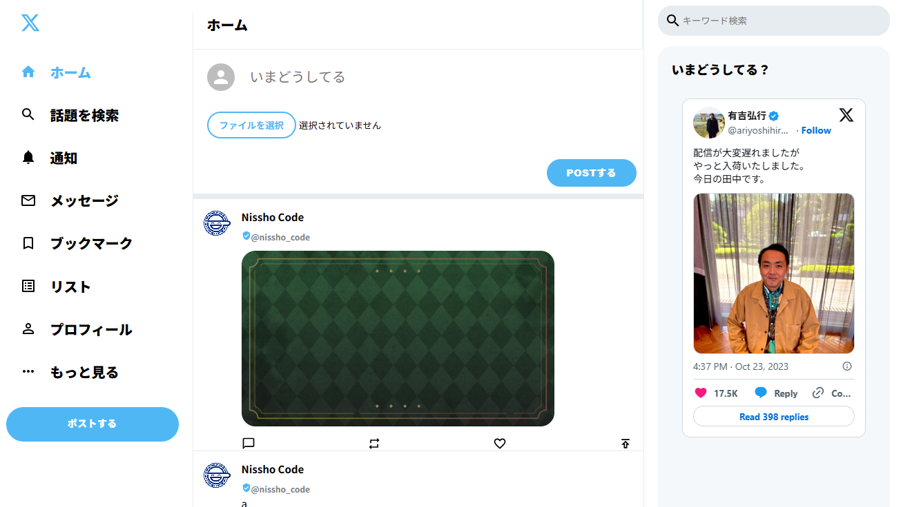

# ✨ XCLONE（React × Firebase）X風SNSアプリ

## 🔍 概要
このアプリは、ReactとFirebaseを使用して構築されたX（旧Twitter）風のSNSアプリです。  
ユーザーは投稿文と画像をアップロードでき、タイムライン上に即時反映されます。  
Material UIを用いたUI設計により、スマートでシンプルな操作体験を実現しています。

## 🛠 使用技術
- React（CRA / JSX / Hooks）
- Firebase（Firestore）
- Material UI（@mui/material）
- CSS（カスタムスタイリング）
- Git / GitHub

## ✨ 主な機能
- テキスト投稿
- 画像アップロード（5MB以下）
- プレビュー表示機能
- 投稿時バリデーション（空・サイズ）
- Firebaseへの投稿保存（Firestore）
- 投稿完了後のフォームリセット
- 投稿内容のリアルタイム反映（予定）

## 📷 スクリーンショット（※一部マスクしています）
### 📝 投稿・タイムライン画面


## 📂 ディレクトリ構成（抜粋）
```bash
xclone/
├── public/
│   ├── index.html
│   ├── logo192.png など
├── src/
│   ├── firebase.jsx ← Firebase設定ファイル
│   ├── App.jsx
│   ├── components/
│   │   ├── sidebar/
│   │   │   ├── Sidebar.jsx
│   │   │   └── SidebarOption.jsx
│   │   ├── timeline/
│   │   │   ├── Timeline.jsx
│   │   │   ├── Tweetbox.jsx ← 投稿フォーム
│   │   │   └── Post.jsx
│   │   └── widget/
│   │       └── Widgets.jsx
│   └── index.js
├── .env.example
├── .gitignore
├── package.json
└── README.md
```

## 💻 起動方法（開発用）
```bash
コピーする
編集する
git clone https://github.com/Jozet42/xclone.git
cd xclone
npm install
npm start
```
.envファイルをルートに設置し、以下の内容を設定してください：

```env
コピーする
編集する
REACT_APP_API_KEY=xxxx
REACT_APP_AUTH_DOMAIN=xxxx
REACT_APP_PROJECT_ID=xxxx
REACT_APP_STORAGE_BUCKET=xxxx
REACT_APP_MESSAGING_SENDER_ID=xxxx
REACT_APP_APP_ID=xxxx
```
参考用に .env.example を同梱しています。

## 🧪 今後の拡張案
- 投稿の編集・削除機能
- ユーザー認証（Firebase Auth）導入
- 投稿に対するコメント機能
- ダークモード切り替え
- タイムラインの無限スクロール化

## 🙌 制作メモ
このアプリは職業訓練校でのReact/Firebase学習の応用として制作しました。
X風の投稿スタイルを取り入れながら、リアルタイム通信と画像処理の実装も行っています。

## 📝 更新履歴
- 2025/04/17：初回コミット＆README作成
- 2025/04/18：Firebase連携 .env 対応完了・警告解消・リファクタリング実施